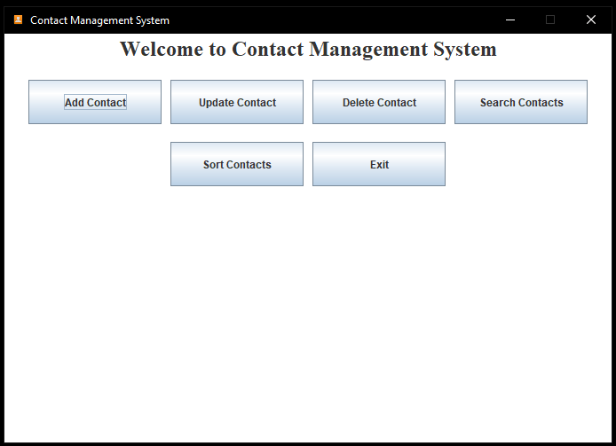
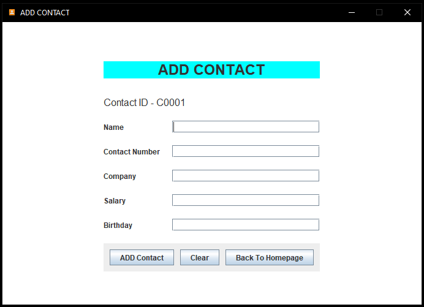
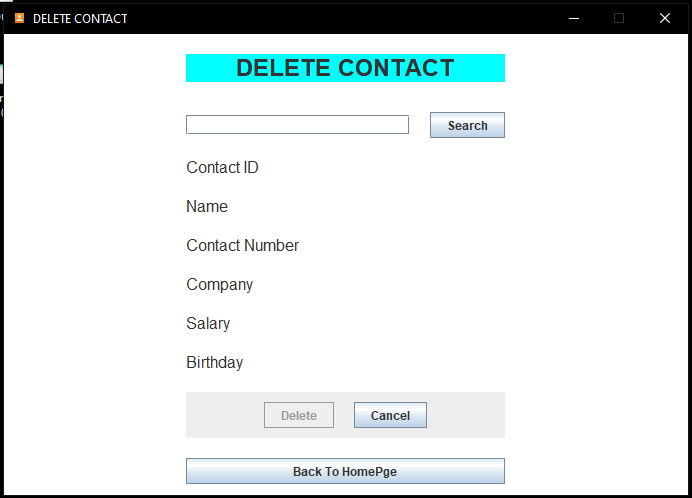
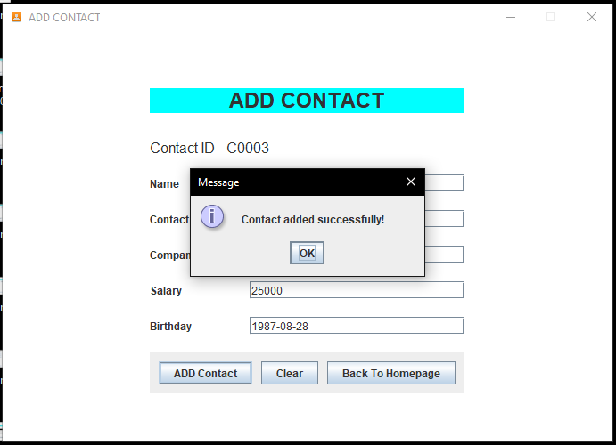
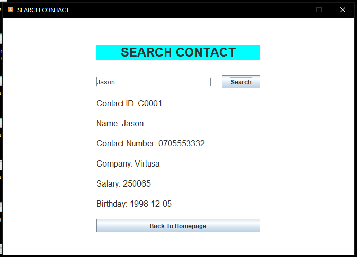
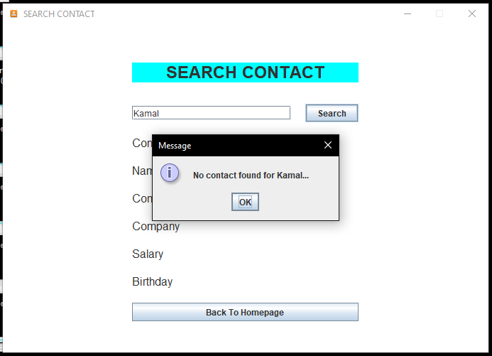
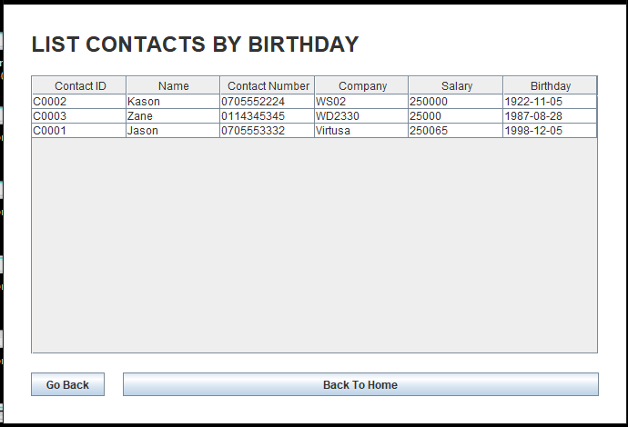
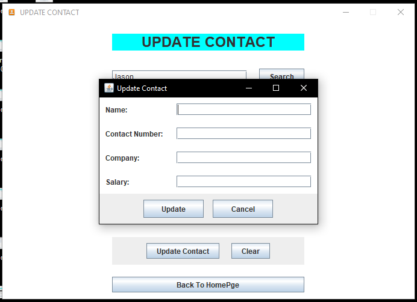

This is a contact management system I am working on, created using Java and Swing for the GUI. In the future, I plan to implement a MySQL database to store all the contacts and perform CRUD operations.

# Preview

